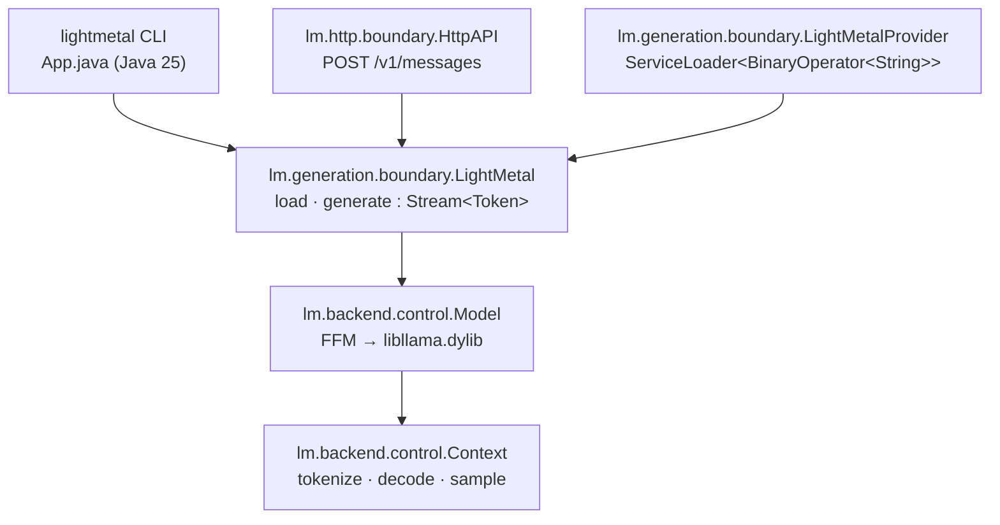

# lightmetal

GPU LLM inference on Apple Silicon from a single Java 25 executable JAR with
zero dependencies. Binds a Metal-enabled `libllama.dylib` through the Foreign
Function & Memory API. Runs Mistral-architecture GGUF models such as Mistral
Medium 3.5.

## Prerequisites

- Java 25+
- [`zb`](https://github.com/AdamBien/zb) on PATH
- `brew install llama.cpp` (provides a Metal-enabled `libllama.dylib`)
- `jextract` on PATH — only to regenerate FFM bindings; pre-generated bindings
  are committed.

## Build and Run

```
zb build
java --enable-native-access=ALL-UNNAMED -jar zbo/lightmetal.jar \
     -model ~/models/gemma-4-31B-it-UD-Q8_K_XL.gguf \
     -prompt "What is the relation between Sun Microsystems and Java"
```

Options: `-max-tokens`, `-temperature`, `-top-p`, `-top-k`, `-min-p`, `-seed`,
`-serve`, `-port`, `-help`.

The only mandatory property is `model` — the GGUF *file name* inside
`models.directory` (defaults to `~/models`). With it set in
`~/.lightmetal/app.properties`:

```properties
models.directory=~/models
model=Mistral-Medium-3.5-128B-UD-Q5_K_XL-00001-of-00003.gguf
```

the invocation collapses to just the prompt (CLI flags still override any
property):

```
java --enable-native-access=ALL-UNNAMED -jar zbo/lightmetal.jar \
     -prompt "What is Java?"
```

See [Configuration](#configuration) for the full property reference.

## HTTP API

`-serve` starts an Anthropic-compatible `POST /v1/messages` endpoint instead of
running a one-shot generation. The model loads once; requests are serialized
because llama.cpp contexts are not thread-safe.

```
java --enable-native-access=ALL-UNNAMED -jar zbo/lightmetal.jar \
     -model ~/models/Mistral-Medium-3.5-128B-UD-Q5_K_XL-00001-of-00003.gguf \
     -serve -port 8080
```

```
curl -s http://localhost:8080/v1/messages \
  -H 'content-type: application/json' \
  -d '{"max_tokens":64,"system":"be terse","messages":[{"role":"user","content":"say hi"}],"temperature":0.7}'
```

Request fields honored: `system`, `messages` (`content` as string or
`[{"type":"text","text":"…"}]` blocks), `max_tokens`, `temperature`. `tools`,
`thinking`, `output_config`, and `model` are accepted and ignored — the loaded
GGUF wins. Response shape matches Anthropic's `{id, content[…], stop_reason,
usage}` so existing clients (e.g. [zsmith](https://github.com/AdamBien/zsmith))
only need a base URL switch.

### OpenAI-compatible endpoints

For tools that speak the OpenAI Chat Completions protocol (Continue, Aider,
Open WebUI, LangChain defaults, etc.), the same server also exposes
`POST /v1/chat/completions` and `GET /v1/models`. The `model` field is
accepted and ignored — the loaded GGUF wins, exactly as with `/v1/messages`.

```
curl -s http://localhost:8080/v1/chat/completions \
  -H 'content-type: application/json' \
  -d '{"model":"lightmetal","messages":[{"role":"user","content":"say hi"}],"max_tokens":64}'
```

Streaming (`stream: true`) is not yet supported and returns HTTP 400.
`tools` are mapped onto the existing Mistral tool pipeline and surface
in the response as standard OpenAI `tool_calls`.

## Embed via SPI

`lightmetal.jar` registers `lm.generation.boundary.LightMetalProvider` as a
`java.util.function.BinaryOperator<String>` via `META-INF/services`. Hosts
load it through `ServiceLoader` and invoke it without compiling against any
lightmetal type — only the JAR on the runtime classpath is needed.

```java
import java.util.ServiceLoader;
import java.util.function.BinaryOperator;

var generator = ServiceLoader.load(BinaryOperator.class).iterator().next();
var response  = generator.apply(
        "/path/to/model.gguf",
        "What is Java?");
System.out.println(response);
```

`apply(model, prompt)` runs a complete one-shot generation with default
sampling parameters and returns the full text. Each call loads and closes the
GGUF, so this path suits sporadic invocations — long-lived hosts should run
`-serve` and hit the HTTP API instead.

The SPI descriptor lives under
`META-INF/services/java.util.function.BinaryOperator`, a JDK-owned namespace.
Hosts running multiple unrelated providers on the same classpath should filter
by `instanceof lm.generation.boundary.LightMetalProvider` rather than relying
on iteration order.

## Architecture



## Configuration

`libllama.dylib` discovery falls back to `brew --prefix llama.cpp`; override
with the `LIGHTMETAL_LIB` environment variable.

### Minimal configuration

Only `model` is mandatory. Everything else has a default, and `template` is
auto-derived from the GGUF when not set explicitly. `model` is the GGUF file
name; the containing directory is taken from `models.directory` (default
`~/models`).

```properties
models.directory=~/models
model=your.gguf
```

Properties are looked up in this order (later wins):

1. Hardcoded defaults
2. GGUF metadata (currently for `template` and `tokenizer.ggml.add_bos_token`)
3. `~/.lightmetal/app.properties` (global)
4. `./app.properties` (project-local)
5. `-Dproperty=value` JVM system properties
6. CLI flags (`-model`, `-prompt`, `-max-tokens`, …)

### Required

| Property | CLI flag | Effect |
|---|---|---|
| `model` | `-model` | Absolute path to a GGUF file. Required unless passed on the CLI. |

### Generation

All optional — defaults shown.

| Property | CLI flag | Default | Effect |
|---|---|---|---|
| `prompt` | `-prompt` | — | One-shot user prompt. Required unless `-serve`. |
| `max-tokens` | `-max-tokens` | `2048` | Max tokens to generate per request. |
| `temperature` | `-temperature` | `0.7` | Sampling temperature. |
| `top-p` | `-top-p` | `0.9` | Nucleus sampling cutoff. |
| `top-k` | `-top-k` | `40` | Top-k sampling cutoff. |
| `min-p` | `-min-p` | `0.05` | Min-p sampling cutoff. |
| `seed` | `-seed` | `nanoTime()` | RNG seed. |

### HTTP server

| Property | CLI flag | Default | Effect |
|---|---|---|---|
| `serve` | `-serve` | `false` | Start `/v1/messages` + `/v1/chat/completions` instead of one-shot generation. |
| `port` | `-port` | `8080` | HTTP listen port. |

### Chat template

| Property | Default | Effect |
|---|---|---|
| `template` | auto-detected from `tokenizer.chat_template` | Active chat template. Currently `mistral4` or `gemma4`. Override if auto-detection picks the wrong one. |
| `mistral4.reasoning_effort` | `none` | Value emitted in the `[MODEL_SETTINGS]{"reasoning_effort":"…"}` block. Typical: `none`, `low`, `medium`, `high`. |
| `gemma4.enable_thinking` | `false` | When `true`, leaves the `<\|channel>thought` block open so the model emits reasoning before its answer (stripped from history on subsequent turns). |

### Context / KV cache

| Property | Default | Effect |
|---|---|---|
| `context.length` | `32768` | KV cache size in tokens. Memory scales linearly. The GGUF's full context (e.g. 262144 for gemma-4) is intentionally NOT auto-applied — that's what the model supports, not what fits your RAM. Raise it explicitly when you need it. |
| `context.batch.size` | `2048` | `n_ubatch` — physical decode chunk size. |
| `context.gpu.layers` | `-1` | Layers offloaded to Metal; `-1` = all. |
| `context.seed` | `0` | Context seed. |

### Environment variables

| Variable | Effect |
|---|---|
| `LIGHTMETAL_LIB` | Absolute path to `libllama.dylib`. Overrides the `brew --prefix llama.cpp` fallback. |
