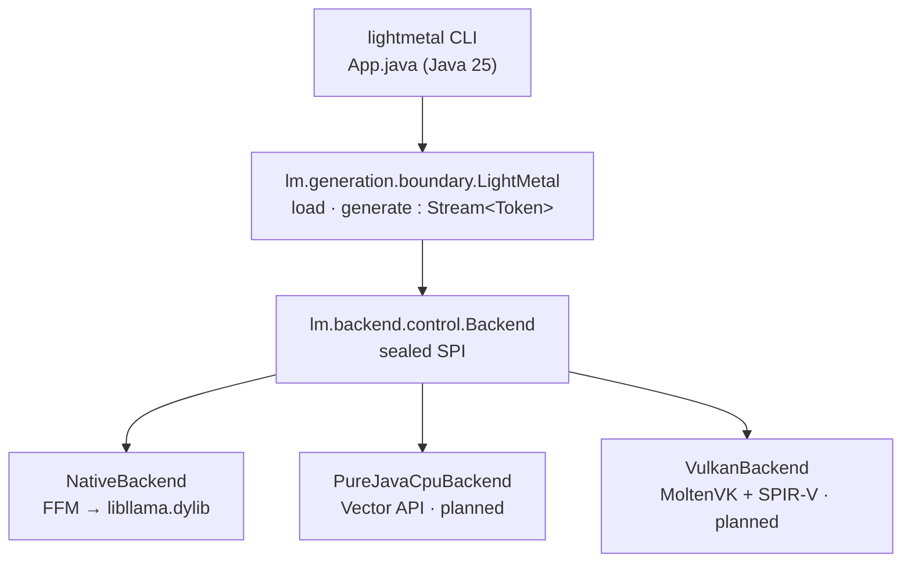

# lightmetal

GPU LLM inference on Apple Silicon from a single Java 25 executable JAR with
zero dependencies. Binds a Metal-enabled `libllama.dylib` through the Foreign
Function & Memory API behind a swappable `Backend` SPI, so the CLI and the
`LightMetal` API are backend-agnostic. Runs Mistral-architecture GGUF models
such as Mistral Medium 3.5.

## Prerequisites

- Java 25+
- [`zb`](https://github.com/AdamBien/zb) on PATH
- `brew install llama.cpp` (provides `libllama.dylib`)
- `jextract` on PATH — only to regenerate FFM bindings; pre-generated bindings
  are committed.

## Build and Run

```
zb build
java --enable-native-access=ALL-UNNAMED -jar zbo/lightmetal.jar \
     -model ~/models/Mistral-Medium-3.5-128B-UD-Q5_K_XL-00001-of-00003.gguf \
     -prompt "Refactor this Java method:"
```

Options: `-backend native|cpu|vulkan` (default `native`), `-max-tokens`,
`-temperature`, `-top-p`, `-top-k`, `-min-p`, `-seed`, `-help`.

## Architecture



## Backends

| Backend | Status | GPU | Native dependency |
|---|---|---|---|
| `NativeBackend` | v1 (working) | Metal / CUDA / ROCm (per dylib build) | `libllama.dylib` |
| `PureJavaCpuBackend` | planned (v1.2) | none | none |
| `VulkanBackend` | planned (v2) | cross-vendor | MoltenVK |

Selected at runtime via `-backend`; swapping is a flag, not a code change.

## Configuration

dylib discovery falls back to `brew --prefix llama.cpp`; override with the
`LIGHTMETAL_LIB` environment variable.

## Design

Rationale, backend trade-offs, the `Backend` SPI contract, FFM memory rules,
roadmap, and open questions: see [`DESIGN.md`](DESIGN.md).
