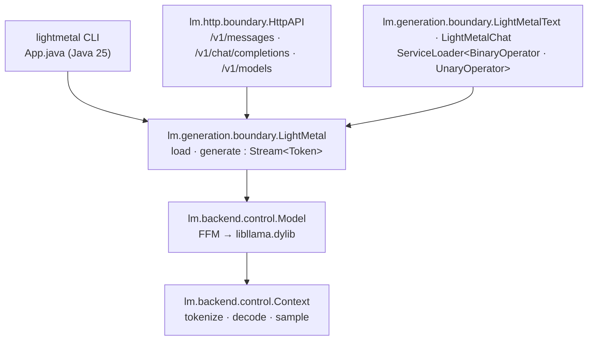

# lightmetal

GPU LLM inference on Apple Silicon from a single Java 25 executable JAR with
zero dependencies. Binds a Metal-enabled `libllama.dylib` through the Foreign
Function & Memory API. Runs Mistral- and Gemma-architecture GGUF models —
Mistral Medium 3.5, Mistral Nemo, Devstral, Gemma 3, Gemma 4.


## Prerequisites

- Java 25+ (e.g. [corretto](https://docs.aws.amazon.com/corretto/latest/corretto-25-ug/downloads-list.html))
- `brew install llama.cpp` (provides a Metal-enabled `libllama.dylib`)
- [`zb`](https://github.com/AdamBien/zb) on PATH — only to build from source;
  prebuilt JARs are published on the [releases page](https://github.com/AdamBien/lightmetal/releases/latest).

## Build and Run

The fastest path is the [`lminstall`](lminstall) script — a single-file Java 25
script (shebang-launched, no `.java` extension, see the
[AIrails.dev](https://airails.dev) `java-cli-script` skill) that drops
`zbo/lightmetal.jar` and the four `lm*` scripts into the current directory:

```
curl -fLO https://github.com/AdamBien/lightmetal/releases/latest/download/lminstall
chmod +x lminstall
./lminstall
```

Or fetch only the JAR, or build from source with `zb`:

```
curl -LO https://github.com/AdamBien/lightmetal/releases/latest/download/lightmetal.jar
# …or…
zb build   # produces zbo/lightmetal.jar
```

```
java --enable-native-access=ALL-UNNAMED -jar lightmetal.jar \
     -model models/gemma-4-31B-it-UD-Q8_K_XL.gguf \
     -prompt "What is the relation between Sun Microsystems and Java"
```

Options: `-max-tokens`, `-temperature`, `-top-p`, `-top-k`, `-min-p`, `-seed`,
`-serve`, `-port`, `-help`.

The only mandatory property is `model` — the GGUF *file name* inside
`models.directory` (defaults to `models`, relative to the current working
directory). With it set in
`~/.lightmetal/app.properties`:

```properties
models.directory=models
model=Mistral-Medium-3.5-128B-UD-Q5_K_XL-00001-of-00003.gguf
```

the invocation collapses to just the prompt (CLI flags still override any
property):

```
java --enable-native-access=ALL-UNNAMED -jar zbo/lightmetal.jar \
     -prompt "What is Java?"
```

See [Configuration](#configuration) for the full property reference.

## HTTP API

`-serve` starts an Anthropic-compatible `POST /v1/messages` endpoint instead of
running a one-shot generation. The model loads once; requests are serialized
because llama.cpp contexts are not thread-safe.

```
java --enable-native-access=ALL-UNNAMED -jar zbo/lightmetal.jar \
     -model models/Mistral-Medium-3.5-128B-UD-Q5_K_XL-00001-of-00003.gguf \
     -serve -port 8080
```

```
curl -s http://localhost:8080/v1/messages \
  -H 'content-type: application/json' \
  -d '{"max_tokens":64,"system":"be terse","messages":[{"role":"user","content":"say hi"}],"temperature":0.7}'
```

Request fields honored: `system`, `messages` (`content` as string or
`[{"type":"text","text":"…"}]` blocks), `max_tokens`, `temperature`. `tools`,
`thinking`, `output_config`, and `model` are accepted and ignored — the loaded
GGUF wins. Response shape matches Anthropic's `{id, content[…], stop_reason,
usage}` so existing clients (e.g. [zsmith](https://github.com/AdamBien/zsmith))
only need a base URL switch.

### OpenAI-compatible endpoints

For tools that speak the OpenAI Chat Completions protocol (Continue, Aider,
Open WebUI, LangChain defaults, etc.), the same server also exposes
`POST /v1/chat/completions` and `GET /v1/models`. The `model` field is
accepted and ignored — the loaded GGUF wins, exactly as with `/v1/messages`.

```
curl -s http://localhost:8080/v1/chat/completions \
  -H 'content-type: application/json' \
  -d '{"model":"lightmetal","messages":[{"role":"user","content":"say hi"}],"max_tokens":64}'
```

Streaming (`stream: true`) is not yet supported and returns HTTP 400.
`tools` are mapped onto the existing Mistral tool pipeline and surface
in the response as standard OpenAI `tool_calls`.

## Embed via SPI

`lightmetal.jar` registers two providers via `META-INF/services`:
`lm.generation.boundary.LightMetalText` as `java.util.function.BinaryOperator<String>`
for plain text completion, and `lm.generation.boundary.LightMetalChat` as
`java.util.function.UnaryOperator<String>` for chat with tool calling
(JSON-in/JSON-out, same shape as `/v1/messages`). Hosts load either through
`ServiceLoader` and invoke it without compiling against any lightmetal type —
only the JAR on the runtime classpath is needed.

```java
import java.util.ServiceLoader;
import java.util.function.BinaryOperator;

var generator = ServiceLoader.load(BinaryOperator.class).iterator().next();
var response  = generator.apply(
        "/path/to/model.gguf",
        "What is Java?");
System.out.println(response);
```

`apply(model, prompt)` runs a complete one-shot generation with default
sampling parameters and returns the full text. Each call loads and closes the
GGUF, so this path suits sporadic invocations — long-lived hosts should run
`-serve` and hit the HTTP API instead.

The SPI descriptors live under `META-INF/services/java.util.function.BinaryOperator`
and `.../UnaryOperator`, JDK-owned namespaces. Hosts running multiple unrelated
providers on the same classpath should filter by
`instanceof lm.generation.boundary.LightMetalText` (or `LightMetalChat`) rather
than relying on iteration order.

## Scripts

The four scripts at the repository root are single-file Java 25 utilities
(shebang-launched, no `.java` extension, see the
[AIrails.dev](https://airails.dev) `java-cli-script` skill) that use
`lightmetal.jar` directly off the classpath. `lminstall` puts them next to
`./zbo/lightmetal.jar`; their shebangs use
`-cp ./zbo/lightmetal.jar:./lightmetal.jar`, so they also work when the JAR
sits side-by-side with the scripts instead of under `zbo/`. Either way, run
them from the directory that holds the JAR. With `model=…` in
`~/.lightmetal/app.properties` they share the same model resolution as the JAR.

| Script | What it does |
|---|---|
| [`lmprompt`](lmprompt) | One-shot REPL: type a prompt, stream the response, print tps. An optional fragment argument (`lmprompt gemma`) is matched against `ModelCatalog.search(…)` and picks the unique match. |
| [`lmlist`](lmlist) | Lists every GGUF in `models.directory`; the active model (`model=…`) is marked with a green `*`. |
| [`lmprobe`](lmprobe) | Inspects a GGUF's metadata — name, architecture, bos/eos token ids, a slice of the vocab, and the raw `tokenizer.chat_template`. Takes an optional file name. |
| [`lmtps`](lmtps) | Measures tokens/sec for the active model on a default prompt. `lmtps -all` benchmarks every model in the catalog; trailing args are joined into a custom prompt. |

```
$ lmprompt
lmprompt 2026-06-07.2
Mistral-Medium-3.5-128B-UD-Q5_K_XL-00001-of-00003> What is Java?
…
[Mistral-Medium-3.5: 42.1 tps]
```

### Sample `lmtps -all` results

Prompt: `Count from 1 to 10.` Some models appear more than once because the
catalog holds multiple quantizations of the same weights. Sorted by tok/s.
All tested models were downloaded from [huggingface.co/unsloth](https://huggingface.co/unsloth).

MacBook Pro M5 Max, 128 GB unified memory:

| Model | Tokens | Time | tok/s |
|---|---:|---:|---:|
| Gemma-4-E2B-It | 33 | 0.3 s | 94.9 |
| Gemma-4-26B-A4B-It | 22 | 0.2 s | 90.0 |
| Mistral Small 4 119B 2603 | 30 | 0.4 s | 74.5 |
| Mistral-7B-Instruct-v0.3 | 31 | 0.5 s | 63.9 |
| Gemma-4-E4B-It | 42 | 0.7 s | 60.5 |
| Gemma-4-12B-It | 22 | 0.6 s | 36.2 |
| Devstral-Small-2-24B-Instruct-2512 | 30 | 0.9 s | 33.8 |
| Gemma-4-31B-It | 21 | 1.3 s | 15.2 |
| Devstral-2-123B-Instruct-2512 | 30 | 4.2 s | 7.0 |
| Mistral-Medium-3.5-128B | 34 | 5.4 s | 6.1 |

Mac Studio M3 Ultra, 128 GB unified memory:

| Model | Tokens | Time | tok/s |
|---|---:|---:|---:|
| Gemma-4-E2B-It | 33 | 0.4 s | 86.0 |
| Gemma-4-26B-A4B-It | 22 | 0.3 s | 81.6 |
| Mistral-7B-Instruct-v0.3 | 31 | 0.4 s | 71.0 |
| Mistral Small 4 119B 2603 | 29 | 0.4 s | 68.1 |
| Mistral-Small-4-119B-2603 | 29 | 0.4 s | 66.2 |
| Gemma-4-E4B-It | 42 | 0.7 s | 56.9 |
| Gemma-4-12B-It | 22 | 0.5 s | 39.8 |
| Devstral-Small-2-24B-Instruct-2512 | 30 | 0.8 s | 37.5 |
| Gemma-4-31B-It | 21 | 1.1 s | 17.4 |
| Devstral-2-123B-Instruct-2512 | 30 | 3.5 s | 8.2 |
| Mistral-Medium-3.5-128B | 34 | 4.6 s | 7.2 |

## Architecture



### Regenerating FFM bindings

The jextract output under `src/main/java/lm/backend/ffm/llama_h/` is committed,
so a normal build needs no extra tooling. To regenerate against a newer
`llama.h`, install [`jextract`](https://github.com/openjdk/jextract) and run
[`src/main/scripts/jextract.sh`](src/main/scripts/jextract.sh).

## Configuration

`libllama.dylib` discovery falls back to `brew --prefix llama.cpp`; override
with the `LIGHTMETAL_LIB` environment variable.

### Minimal configuration

Only `model` is mandatory. Everything else has a default, and `template` is
auto-derived from the GGUF when not set explicitly. `model` is the GGUF file
name; the containing directory is taken from `models.directory` (default
`models`, relative to the current working directory).

```properties
models.directory=models
model=your.gguf
```

Properties are looked up in this order (later wins):

1. Hardcoded defaults
2. GGUF metadata (currently for `template` and `tokenizer.ggml.add_bos_token`)
3. `~/.lightmetal/app.properties` (global)
4. `./app.properties` (project-local)
5. `-Dproperty=value` JVM system properties
6. CLI flags (`-model`, `-prompt`, `-max-tokens`, …)

### Required

| Property | CLI flag | Effect |
|---|---|---|
| `model` | `-model` | Absolute path to a GGUF file. Required unless passed on the CLI. |

### Generation

All optional — defaults shown.

| Property | CLI flag | Default | Effect |
|---|---|---|---|
| `prompt` | `-prompt` | — | One-shot user prompt. Required unless `-serve`. |
| `max-tokens` | `-max-tokens` | `2048` | Max tokens to generate per request. |
| `temperature` | `-temperature` | `0.7` | Sampling temperature. |
| `top-p` | `-top-p` | `0.9` | Nucleus sampling cutoff. |
| `top-k` | `-top-k` | `40` | Top-k sampling cutoff. |
| `min-p` | `-min-p` | `0.05` | Min-p sampling cutoff. |
| `seed` | `-seed` | `nanoTime()` | RNG seed. |

### HTTP server

| Property | CLI flag | Default | Effect |
|---|---|---|---|
| `serve` | `-serve` | `false` | Start `/v1/messages` + `/v1/chat/completions` instead of one-shot generation. |
| `port` | `-port` | `8080` | HTTP listen port. |

### Chat template

| Property | Default | Effect |
|---|---|---|
| `template` | auto-detected from `tokenizer.chat_template` | Active chat template. Currently `mistral4` or `gemma4`. Override if auto-detection picks the wrong one. |
| `mistral4.reasoning_effort` | `none` | Value emitted in the `[MODEL_SETTINGS]{"reasoning_effort":"…"}` block. Typical: `none`, `low`, `medium`, `high`. |
| `gemma4.enable_thinking` | `false` | When `true`, leaves the `<\|channel>thought` block open so the model emits reasoning before its answer (stripped from history on subsequent turns). |

### Context / KV cache

| Property | Default | Effect |
|---|---|---|
| `context.length` | `32768` | KV cache size in tokens. Memory scales linearly. The GGUF's full context (e.g. 262144 for gemma-4) is intentionally NOT auto-applied — that's what the model supports, not what fits your RAM. Raise it explicitly when you need it. |
| `context.batch.size` | `2048` | `n_ubatch` — physical decode chunk size. |

### Debugging

| Property | Default | Effect |
|---|---|---|
| `debug` | `false` | When `true`, dumps every GGUF kv pair at load (`[inspector]   key = …`) and logs each stop-sequence match (`[stop] matched …`). |
| `progress` | `true` | Emits a cyan dot on stderr for each llama.cpp log tick during model load and inference. Set to `false` for clean output (e.g. when piping or benchmarking — `lmtps` disables it). |

### Environment variables

| Variable | Effect |
|---|---|
| `LIGHTMETAL_LIB` | Absolute path to `libllama.dylib`. Overrides the `brew --prefix llama.cpp` fallback. |

## Workshops

Hands-on workshops on Java, AI, Agents and Clouds:
[airhacks.live](https://airhacks.live).
