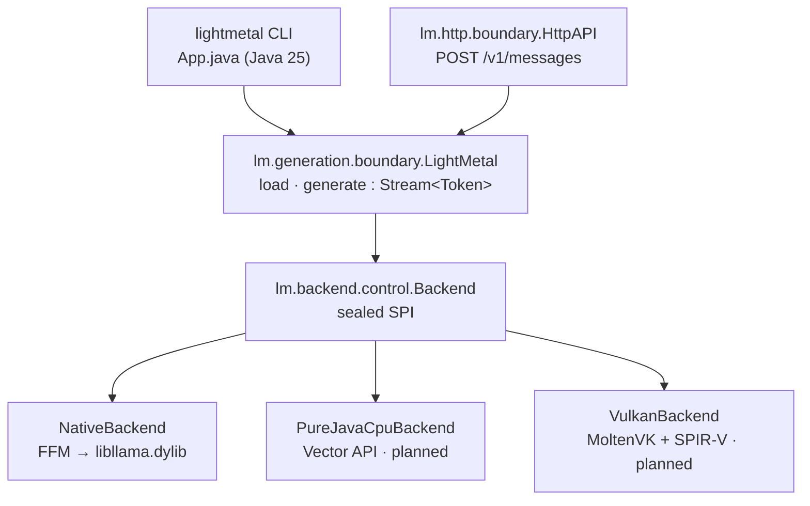

# lightmetal

GPU LLM inference on Apple Silicon from a single Java 25 executable JAR with
zero dependencies. Binds a Metal-enabled `libllama.dylib` through the Foreign
Function & Memory API behind a swappable `Backend` SPI, so the CLI and the
`LightMetal` API are backend-agnostic. Runs Mistral-architecture GGUF models
such as Mistral Medium 3.5.

## Prerequisites

- Java 25+
- [`zb`](https://github.com/AdamBien/zb) on PATH
- `brew install llama.cpp` (provides `libllama.dylib`)
- `jextract` on PATH — only to regenerate FFM bindings; pre-generated bindings
  are committed.

## Build and Run

```
zb build
java --enable-native-access=ALL-UNNAMED -jar zbo/lightmetal.jar \
     -model ~/models/Mistral-Medium-3.5-128B-UD-Q5_K_XL-00001-of-00003.gguf \
     -prompt "Refactor this Java method:"
```

Options: `-backend native|cpu|vulkan` (default `native`), `-max-tokens`,
`-temperature`, `-top-p`, `-top-k`, `-min-p`, `-seed`, `-serve`, `-port`,
`-help`.

With every parameter set in `~/.lightmetal/app.properties`:

```properties
model=/Users/duke/Downloads/Mistral-Medium-3.5-128B-UD-Q5_K_XL-00001-of-00003.gguf
backend=native
max-tokens=256
temperature=0.7
top-p=0.9
top-k=40
min-p=0.05
```

the invocation collapses to just the prompt (CLI flags still override any
property):

```
java --enable-native-access=ALL-UNNAMED -jar zbo/lightmetal.jar \
     -prompt "What is Java?"
```

## HTTP API

`-serve` starts an Anthropic-compatible `POST /v1/messages` endpoint instead of
running a one-shot generation. The model loads once; requests are serialized
because llama.cpp contexts are not thread-safe.

```
java --enable-native-access=ALL-UNNAMED -jar zbo/lightmetal.jar \
     -model ~/models/Mistral-Medium-3.5-128B-UD-Q5_K_XL-00001-of-00003.gguf \
     -serve -port 8080
```

```
curl -s http://localhost:8080/v1/messages \
  -H 'content-type: application/json' \
  -d '{"max_tokens":64,"system":"be terse","messages":[{"role":"user","content":"say hi"}],"temperature":0.7}'
```

Request fields honored: `system`, `messages` (`content` as string or
`[{"type":"text","text":"…"}]` blocks), `max_tokens`, `temperature`. `tools`,
`thinking`, `output_config`, and `model` are accepted and ignored — the loaded
GGUF wins. Response shape matches Anthropic's `{id, content[…], stop_reason,
usage}` so existing clients (e.g. [zsmith](https://github.com/AdamBien/zsmith))
only need a base URL switch.

## Architecture



## Backends

| Backend | Status | GPU | Native dependency |
|---|---|---|---|
| `NativeBackend` | v1 (working) | Metal / CUDA / ROCm (per dylib build) | `libllama.dylib` |
| `PureJavaCpuBackend` | planned (v1.2) | none | none |
| `VulkanBackend` | planned (v2) | cross-vendor | MoltenVK |

Selected at runtime via `-backend`; swapping is a flag, not a code change.

## Configuration

dylib discovery falls back to `brew --prefix llama.cpp`; override with the
`LIGHTMETAL_LIB` environment variable.